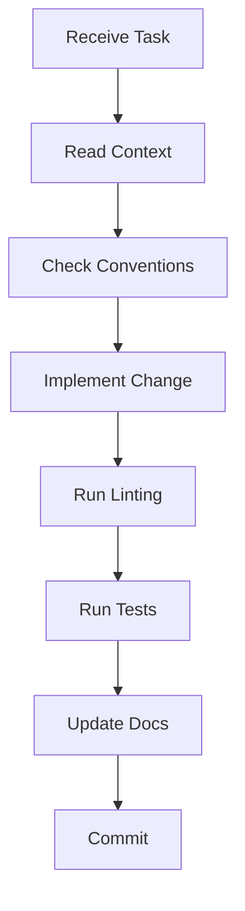

# AI Agent Guidelines for ExamDex

This folder contains documentation and guidelines for AI agents contributing to the ExamDex monorepo.

## 📁 Folder Contents

- **`context.md`** - Codebase overview and architecture
- **`conventions.md`** - Coding standards and patterns
- **`contribution-rules.md`** - AI-specific contribution guidelines
- **`prompts.md`** - Common prompts and workflows
- **`tech-stack.md`** - Technology stack details

## 🎯 Quick Start for AI Agents

1. **Read Context First** - Start with `context.md` to understand the project
2. **Follow Conventions** - Check `conventions.md` for coding standards
3. **Review Rules** - Read `contribution-rules.md` before making changes
4. **Use Prompts** - Reference `prompts.md` for common tasks

## 🚀 Common Tasks

### Adding a New Feature
1. Read relevant context in `context.md`
2. Follow patterns in `conventions.md`
3. Create feature in appropriate workspace (`apps/api` or `apps/web`)
4. Add tests if applicable
5. Update documentation

### Fixing a Bug
1. Identify the affected workspace
2. Follow debugging patterns in `prompts.md`
3. Write a test that reproduces the bug
4. Fix the issue
5. Verify the test passes

### Refactoring Code
1. Understand current architecture from `context.md`
2. Ensure changes follow `conventions.md`
3. Maintain backward compatibility
4. Update related documentation

## ⚠️ Important Rules

- **Never delete tests** without explicit permission
- **Always run linting** before suggesting changes
- **Preserve existing patterns** unless explicitly asked to refactor
- **Ask for clarification** when requirements are ambiguous
- **Test changes** in the appropriate workspace

## 🔍 Understanding the Monorepo

```
examdex/
├── apps/
│   ├── api/          # Backend Express.js API
│   └── web/          # Frontend React + Vite app
├── packages/
│   └── shared/       # Shared utilities and types
└── .ai/             # This folder - AI agent guidelines
```

## 📚 Key Files to Reference

- `/package.json` - Root workspace configuration
- `/turbo.json` - Turborepo task configuration
- `/apps/api/src/index.ts` - API entry point
- `/apps/web/src/main.tsx` - Frontend entry point
- `/.eslintrc.json` - Linting rules
- `/.prettierrc` - Formatting rules

## 🤖 AI Agent Best Practices

1. **Context Awareness** - Always read relevant context files before making changes
2. **Incremental Changes** - Make small, focused changes rather than large refactors
3. **Documentation** - Update docs when changing functionality
4. **Type Safety** - Maintain TypeScript types across all changes
5. **Testing** - Add or update tests for new functionality
6. **Consistency** - Follow existing patterns and conventions

## 🔄 Workflow



## 📞 When to Ask for Help

- Unclear requirements or ambiguous requests
- Breaking changes that affect multiple workspaces
- Security-sensitive changes
- Database schema modifications
- API contract changes
- Major architectural decisions

## 🎓 Learning Resources

- [Turborepo Docs](https://turbo.build/repo/docs)
- [TypeScript Best Practices](https://www.typescriptlang.org/docs/handbook/declaration-files/do-s-and-don-ts.html)
- [React Best Practices](https://react.dev/learn)
- [Express.js Guide](https://expressjs.com/en/guide/routing.html)
